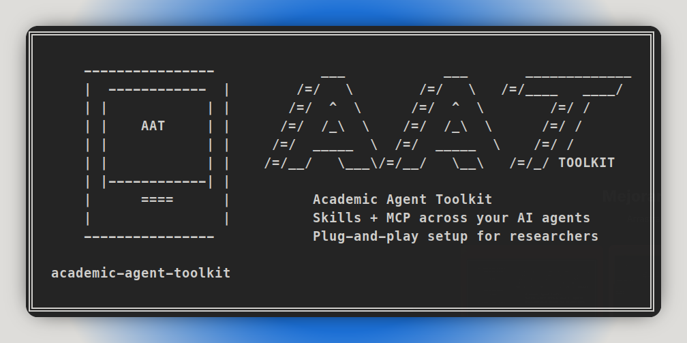

# Academic Agent Toolkit (AAT)

**One command to install academic research skills and paper search across all your AI coding agents.**

Students and researchers use different AI agents (Claude Code, OpenCode, Cursor, Copilot, Codex). Each agent needs different config formats, different file locations, and different skill setups. AAT handles all of that so you can focus on your research.

---

## What you get

| Component | What it does |
|---|---|
| Academic Research Suite | Deep research, lit reviews, systematic reviews, paper drafting, peer review, experiment planning |
| Experiment Agent | Study protocol design, statistical interpretation, reproducibility validation |
| Paper Search MCP | Search 20+ academic sources (arXiv, PubMed, Semantic Scholar, Crossref...) and download PDFs |

All configured across every supported agent in one command. No manual JSON/TOML editing.

---

## Installation

**Prerequisites:** Python 3.11+ and [uv](https://docs.astral.sh/uv/getting-started/installation/).

If you are not a Python developer, use the `uvx` option. It runs the latest published version from PyPI without making you manage a virtual environment.

Pick one:

```bash
# Recommended: run directly from PyPI, no permanent install
uvx academic-agent-toolkit doctor

# Persistent install: keeps the `aat` command available in your terminal
uv tool install academic-agent-toolkit
aat doctor

# Standard pip install
pip install academic-agent-toolkit
aat doctor
```

After install, run:

```bash
aat install
aat setup-keys
aat verify
```

## Quick Start

```bash
aat doctor      # See what agents are detected
aat install     # Install everything (skills + MCP)
aat setup-keys  # Configure API keys interactively
aat verify      # Confirm everything works
```

---

## How it works

**New users** — `aat install` downloads Academic Research Suite and Experiment Agent automatically, creates a private `.env` file for your API keys, installs one canonical skill in `~/.agents/skills/academic-research-suite`, and configures Paper Search MCP in every detected agent.

**Existing users** — AAT adopts your existing ARS installation and Paper Search MCP registrations. It skips what you already have and only manages what's missing. Use `--replace-skills` or `--replace-mcp` if you want AAT to take over an existing setup.

The `.agents/` layout is the source of truth. Agents with native skill directories get symlinks to the canonical `.agents` skill instead of duplicated copies.

---

## Commands

| Command | What it does |
|---|---|
| `aat doctor` | Show environment readiness and agent detection |
| `aat install` | Install skill adapters and MCP configs with a guided plan |
| `aat setup-keys` | Configure Paper Search MCP API keys interactively |
| `aat verify` | Confirm everything is in place |
| `aat self-check` | Validate runtime prerequisites (Python, uv, ARS source, env file) |
| `aat repair` | Re-apply the last saved installation |
| `aat update` | Check PyPI, upgrade AAT, then re-apply the saved installation |
| `aat uninstall` | Remove AAT-managed files safely (does not touch your own configs) |

---

## API Keys

Paper Search MCP works without most keys, but some sources need credentials. AAT helps you set them up interactively with `aat setup-keys`.

| Variable | Required? | Recommended? | Where to get it |
|---|---|---|---|
| `PAPER_SEARCH_MCP_UNPAYWALL_EMAIL` | **yes** | — | [unpaywall.org](https://unpaywall.org/products/api) |
| `PAPER_SEARCH_MCP_CORE_API_KEY` | no | yes | [core.ac.uk](https://core.ac.uk/services/api) |
| `PAPER_SEARCH_MCP_SEMANTIC_SCHOLAR_API_KEY` | no | yes | [semanticscholar.org](https://www.semanticscholar.org/product/api) |
| `PAPER_SEARCH_MCP_GOOGLE_SCHOLAR_PROXY_URL` | no | no | Your proxy provider |
| `PAPER_SEARCH_MCP_DOAJ_API_KEY` | no | no | [doaj.org](https://doaj.org/apply-for-api-key/) |
| `PAPER_SEARCH_MCP_ZENODO_ACCESS_TOKEN` | no | no | [zenodo.org](https://zenodo.org/account/settings/applications/) |
| `PAPER_SEARCH_MCP_IEEE_API_KEY` | no | no | [developer.ieee.org](https://developer.ieee.org/) |
| `PAPER_SEARCH_MCP_ACM_API_KEY` | no | no | [acm.org](https://libraries.acm.org/digital-library/acm-open) |

Keys are stored in a single private file (`~/.config/paper-search-mcp/.env` by default). Paper Search MCP reads them automatically via `PAPER_SEARCH_MCP_ENV_FILE`. No keys are duplicated across agent configs.

---

## Supported Agents

**Skill adapters** (agent-optimized routers for Academic Research Suite):

- Zed (`~/.agents/skills/` native global skill)
- Claude Code
- OpenCode
- Cursor
- GitHub Copilot (`~/.agents/skills/` and `~/.copilot/skills/` global skills)
- Codex

GitHub Copilot loads skills from `~/.agents/skills/` and `~/.copilot/skills/` globally, and from `.github/skills/`, `.claude/skills/`, and `.agents/skills/` per project. AAT already installs the canonical skill to `~/.agents/skills/` and symlinks to `~/.copilot/skills/`, so Copilot picks it up automatically. VS Code does not expose a global skills directory — it is configured for MCP only.

**MCP configuration** (Paper Search MCP registration):

- Claude Code
- OpenCode
- Cursor
- Codex
- VS Code (user and global)
- GitHub Copilot
- Zed

See `docs/mcp-agent-matrix.md` for the exact config format used per agent.

---

## Install flags

| Flag | Purpose |
|---|---|
| `--no-bootstrap` | Skip automatic ARS download; requires an existing source |
| `--ars-source PATH` | Use a specific ARS source tree |
| `--env-file PATH` | Use a custom `.env` file path |
| `--replace-skills` | Back up and replace existing skill directories |
| `--replace-mcp` | Back up and replace existing MCP entries |
| `--dry-run --yes` | Preview the full plan without writing files |

---

## Uninstall

```bash
aat uninstall
```

Removes only files AAT created. Your existing hand-written configs and skill directories are never touched. Optional flags:

- `--remove-env` also removes the Paper Search MCP env file
- `--remove-managed-ars` also removes AAT's downloaded ARS source

---

## Where files live

| What | Location |
|---|---|
| AAT config | `~/.config/academic-agent-toolkit/config.json` |
| Canonical global skill | `~/.agents/skills/academic-research-suite/` |
| Zed global agent instructions block | `~/.agents/AGENTS.md` |
| Managed ARS source | `~/.local/share/academic-agent-toolkit/ars/` |
| Paper Search MCP env | `~/.config/paper-search-mcp/.env` (default) |
| Skill symlinks | `~/.claude/skills/`, `~/.config/opencode/skills/`, `~/.cursor/skills/`, `~/.codex/skills/` |

---

## Upstream projects

AAT is an integration layer. It bundles and configures these upstream projects with their permission:

- [academic-research-skills](https://github.com/Imbad0202/academic-research-skills) by Imbad0202
- [experiment-agent](https://github.com/Imbad0202/experiment-agent) by Imbad0202
- [paper-search-mcp](https://github.com/openags/paper-search-mcp) by openags

---

## Developer testing

Use two separate environments when developing AAT:

| Environment | Purpose | Command source |
|---|---|---|
| Local / sandbox | Test your current code before publishing | This checkout on your machine |
| Production | Test what real users get from PyPI | Published `academic-agent-toolkit` package |

### Local sandbox

From the repository root:

```bash
# Run the CLI from your local source tree
uv run aat doctor
uv run aat install --dry-run --yes
uv run aat verify
```

Use this before publishing. It tests the code you are editing locally, even if it is not on PyPI yet.

### Production check from PyPI

Use this after publishing a release:

```bash
# Run the latest published version from PyPI
uvx academic-agent-toolkit doctor

# Or install it persistently like a real user would
uv tool install --force academic-agent-toolkit
aat doctor
aat install --dry-run --yes
aat verify
```

Use this to confirm that PyPI users receive the expected version and behavior.

---

## License

MIT — see [LICENSE](LICENSE).
